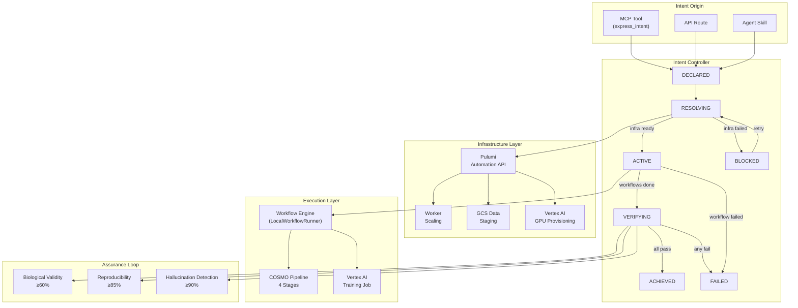
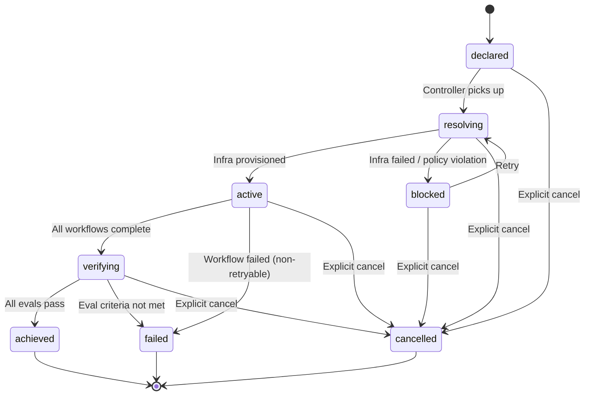
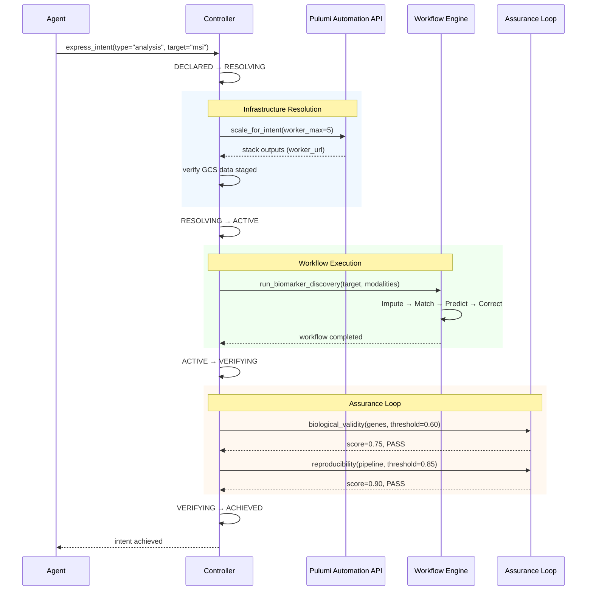
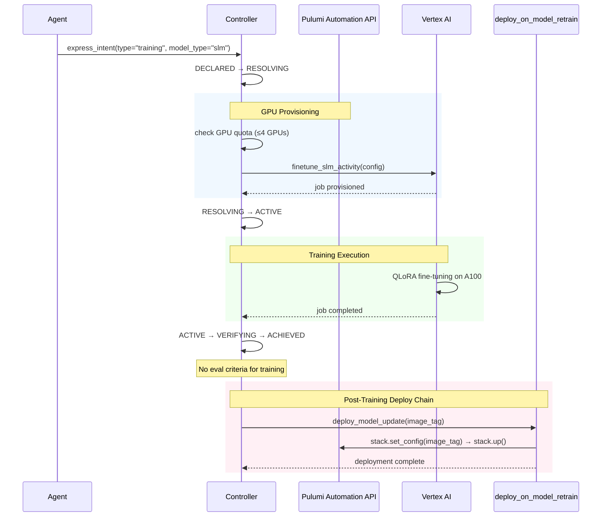
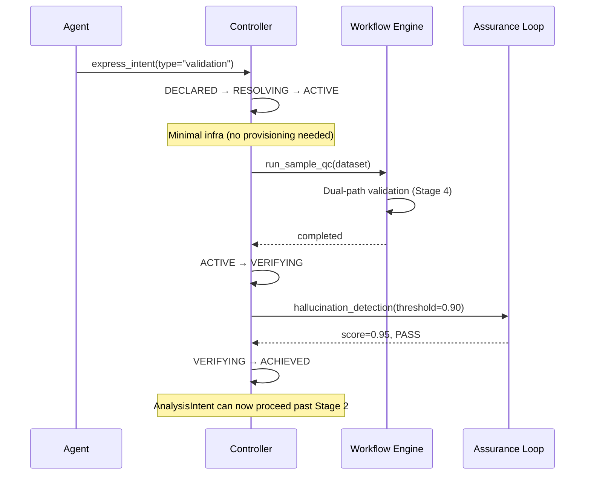
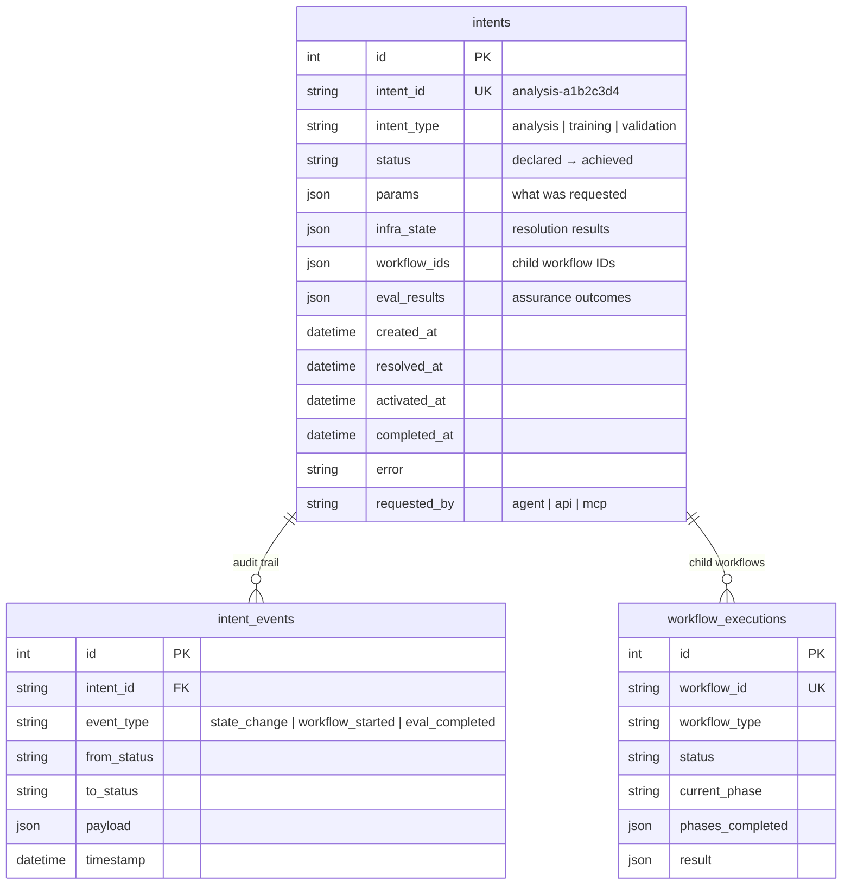
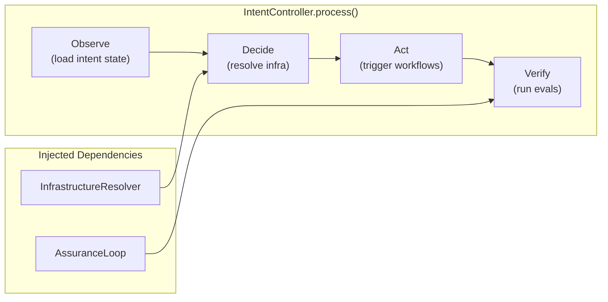
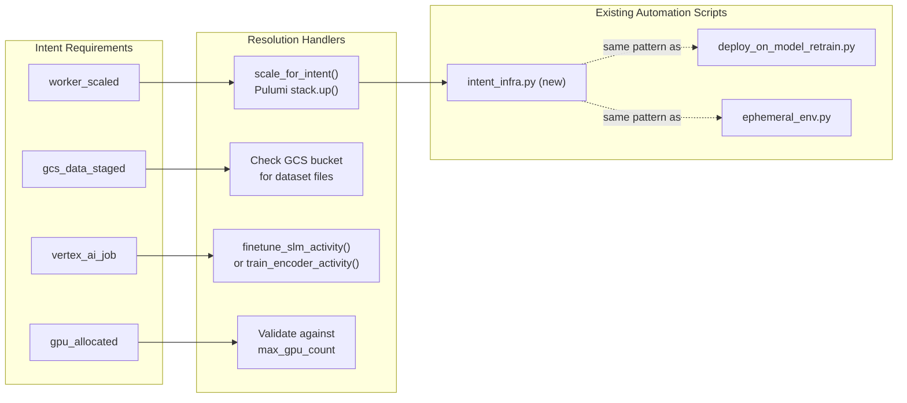

# Intent Lifecycle Workflow

The intent lifecycle layer sits between the agent/workflow layer and the Pulumi infrastructure layer, formalizing agent goals as infrastructure-level concerns with the **observe-decide-act-verify** loop from intent-based networking.

## Overview



## State Machine

The intent lifecycle uses an explicit state machine with the following states and transitions:



| State | Description | Phase |
|-------|-------------|-------|
| `declared` | Intent expressed, not yet acted on | — |
| `resolving` | Checking/provisioning infrastructure via Pulumi | **Decide** |
| `blocked` | Infra resolution failed or prerequisite unmet | **Decide** (retry) |
| `active` | Child workflows executing | **Act** |
| `verifying` | Eval assurance loop running | **Verify** |
| `achieved` | All success criteria met (terminal) | — |
| `failed` | Criteria not met or unrecoverable error (terminal) | — |
| `cancelled` | Explicitly cancelled (terminal) | — |

## Three Intent Types

### AnalysisIntent

Biomarker discovery, sample QC, or cross-omics matching on a dataset.



**Infrastructure needs:** Worker service scaled, GCS data staged.
**Success criteria:** Biological validity ≥ 60% pathway coverage, reproducibility ≥ 85% Jaccard.
**Validation gate:** Cannot proceed past COSMO Stage 2 without a passing `ValidationIntent`.

### TrainingIntent

Fine-tune BioMistral, retrain expression encoder, or run GPU-accelerated classification.



**Infrastructure needs:** Vertex AI training job provisioned, GPU quota validated.
**Success criteria:** Job completion (no eval criteria).
**Post-success:** Automatically chains to `deploy_on_model_retrain.deploy_model_update()`.
**Guardrail:** Max 4 GPUs per stack (enforced by CrossGuard policy).

### ValidationIntent

Cross-omics concordance verification — acts as a gate for AnalysisIntent.



**Infrastructure needs:** None (minimal).
**Success criteria:** Hallucination detection ≥ 90% citation verification.
**Purpose:** No AnalysisIntent proceeds past COSMO Stage 2 without a passing ValidationIntent.

## Data Model

Two PostgreSQL tables persist intent state (same SQLModel pattern as `workflows/progress.py`):



## Controller Architecture

The controller is **not** a long-running daemon. It is called per-intent and is idempotent — safe to call repeatedly, advancing the intent through whatever state transition is currently possible.



```python
# Idempotent — call repeatedly to advance the intent
controller = get_controller()
result = await controller.process(intent_id)
# Returns the intent dict with updated status
```

## Infrastructure Resolution

The `InfrastructureResolver` maps intent requirements to Pulumi Automation API operations, wrapping existing scripts in `infra/automation/`:



## Assurance Loop

The `AssuranceLoop` wraps the existing `evals/` framework and wires eval results into intent state transitions:

| Eval | Class | Threshold | Used By |
|------|-------|-----------|---------|
| Biological Validity | `BiologicalValidityEval` | ≥ 60% pathway coverage | AnalysisIntent |
| Reproducibility | `ReproducibilityEval` | ≥ 85% pairwise Jaccard | AnalysisIntent |
| Hallucination Detection | `HallucinationDetectionEval` | ≥ 90% citation verification | ValidationIntent |

All evals return `EvalResult(name, passed, score, threshold, details)`. If `all_passed()` returns `True`, the intent transitions to `achieved`. Otherwise, `failed`.

## MCP Integration

Two new tools are registered in the MCP server (11 total):

| Tool | Input | Output | Purpose |
|------|-------|--------|---------|
| `express_intent` | `{intent_type, params}` | `{intent_id, status, message}` | Create and begin processing an intent |
| `get_intent_status` | `{intent_id}` | `{status, workflow_ids, eval_results, ...}` | Poll intent progress and results |

Example agent interaction:

```
Agent: Call express_intent with intent_type="analysis", params={"target": "msi", "dataset": "train"}
→ Returns: intent_id="analysis-a1b2c3d4", status="resolving"

Agent: Call get_intent_status with intent_id="analysis-a1b2c3d4"
→ Returns: status="verifying", eval_results={"biological_validity": {"score": 0.75, "passed": true}}

Agent: Call get_intent_status with intent_id="analysis-a1b2c3d4"
→ Returns: status="achieved"
```

## CrossGuard Policy Extensions

Two new policies extend the existing 8 compliance guardrails:

| Policy | Level | Rule |
|--------|-------|------|
| `training-gpu-limit` | Mandatory | Training intents cannot provision > 4 GPUs per stack |
| `intent-resource-labels` | Advisory | Intent-provisioned resources should carry `intent-id` and `intent-type` labels |

## File Layout

```
intents/                              # Intent lifecycle layer
├── __init__.py                       # Exports
├── schemas.py                        # IntentStatus enum, valid transitions
├── types.py                          # AnalysisIntentSpec, TrainingIntentSpec, ValidationIntentSpec
├── models.py                         # SQLModel tables + persistence functions
├── controller.py                     # IntentController (observe-decide-act-verify)
├── infra_resolver.py                 # Maps intent needs → Pulumi Automation API
├── assurance.py                      # Wraps evals/ for intent success/failure
├── service.py                        # create_intent(), get_intent(), get_controller()

infra/automation/intent_infra.py      # Pulumi Automation API for intent scaling
infra/policies/genomics_policies.py   # +2 intent-specific CrossGuard policies

mcp_server/schemas/intents.py         # Pydantic I/O schemas for intent tools
mcp_server/tools/intent_manager.py    # express_intent tool
mcp_server/tools/intent_status.py     # get_intent_status tool
```

## Design Principles

1. **Intents are not workflows.** A workflow is an execution plan. An intent is a goal with success criteria. One intent may trigger multiple workflows.
2. **Eval metrics are the assurance loop.** Quantitative thresholds from `evals/` drive `active → achieved` vs `active → failed`.
3. **Pulumi Automation API, not raw gcloud.** Infrastructure changes go through the same stack operations as `deploy_on_model_retrain.py`.
4. **Controller is idempotent.** Safe to call `process()` repeatedly — advances through whatever transition is possible.
5. **Core ML untouched.** `core/` doesn't know about intents. The intent layer orchestrates around it.

## Future: Go Migration

The intent controller is a natural candidate for migration to Go:
- Go's concurrency model (goroutines, channels) fits the observe-decide-act-verify loop
- Single-binary deployment simplifies the controller as a long-running service
- Pulumi has first-class Go Automation API support
- The controller's interface is simple enough to port without changing the data model

Ship in Python first alongside the existing stack. Migrate to Go when the lifecycle stabilizes.
