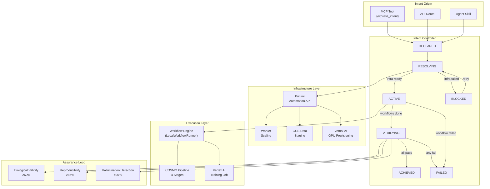
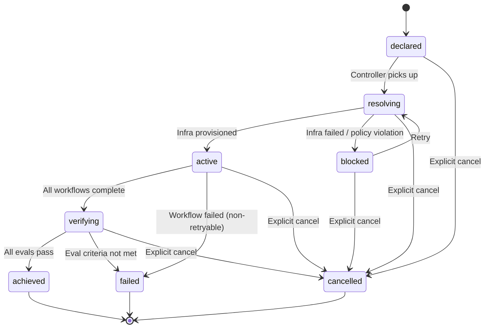
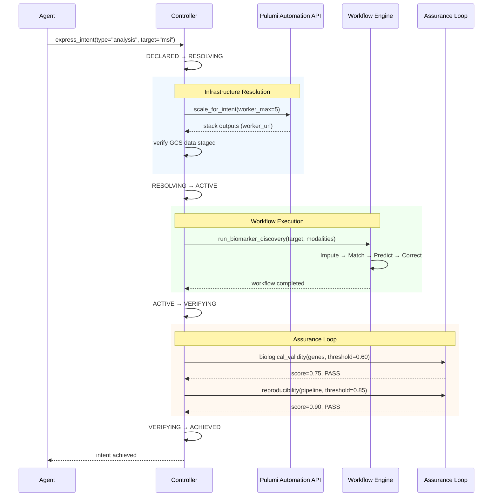
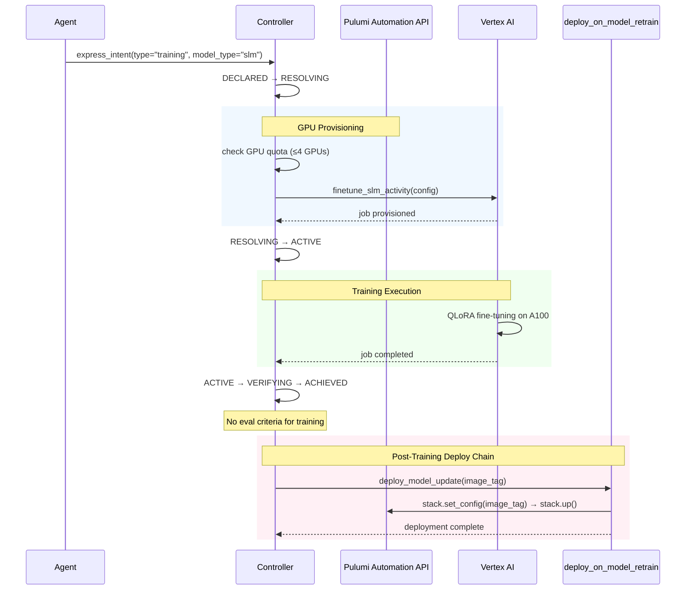
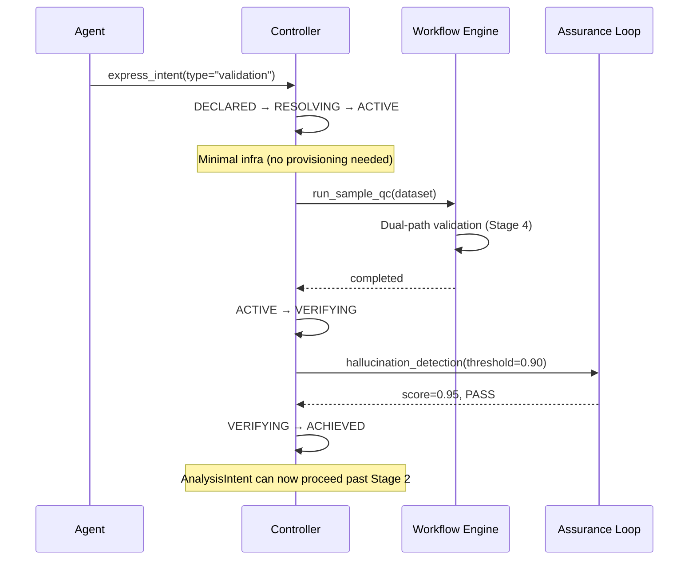
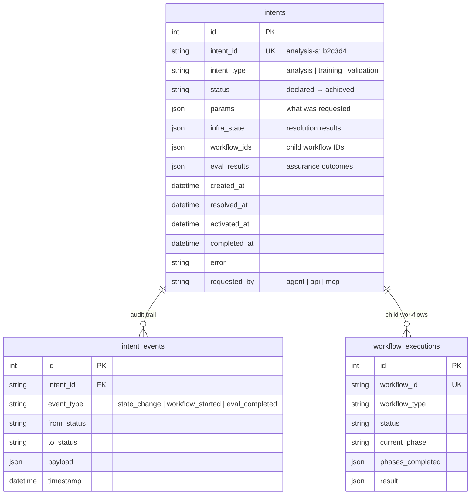
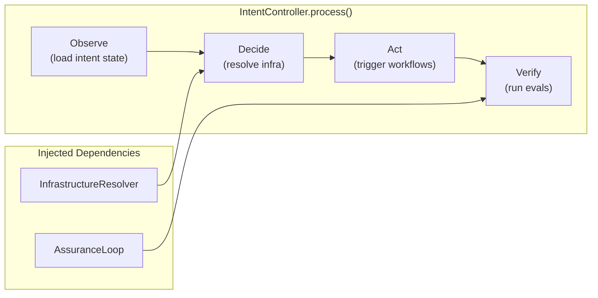
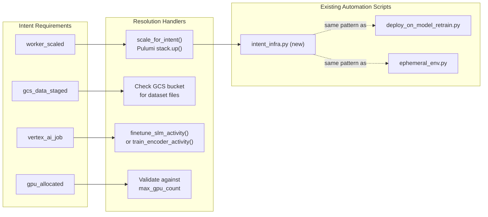

# The Intent Plane

Traditional Kubernetes architecture consists of two layers: a **data plane** (where workloads run) and a **control plane** (which manages cluster state). The intent plane is a third layer purpose-built for agent operations — it allows AI agents to declare goals and have infrastructure respond autonomously, without requiring human-in-the-loop approval at each step.

This implementation is the application-level realization of that concept for precision genomics workloads.

## Autonomous Agent Operations

The Go intent-controller (`intent-controller/internal/intent/manager.go`) implements a self-driving state machine. An agent calls `POST /api/v1/intents` with a declarative spec — `{"intent_type": "analysis", "params": {"target": "msi"}}` — and the controller autonomously drives through the full lifecycle:

```
DECLARED → RESOLVING → ACTIVE → VERIFYING → ACHIEVED / FAILED
```

No human approval gates exist between states. The reconciler (`intent-controller/internal/intent/reconciler.go`) polls non-terminal intents on a timer and advances each one. Programmatic eval criteria (biological validity >= 60%, reproducibility >= 85%, hallucination detection >= 90%) replace human judgment in the VERIFYING phase — the assurance loop determines success or failure without intervention.

## Bridging AI and Infrastructure

The core of the intent plane is the bridge between agent goals and infrastructure provisioning. When an intent declares requirements like `required_infra: ["worker_scaled", "gcs_data_staged"]`, the activity dispatcher (`intent-controller/internal/activity/dispatcher.go`) and the manager's `resolveAndActivate()` method translate these into concrete infrastructure operations — Pulumi Automation API calls for worker scaling, GCS data staging verification, Vertex AI job provisioning, and GPU quota validation.

The agent never manages infrastructure directly. It declares intent; the controller bridges to infrastructure:

```
Agent → Intent Plane (:8090) → Pulumi / GCS / Vertex AI
                ↓
         ML Service (:8000)
```

Intent specs (`intent-controller/internal/models/intent.go`) bind each intent type to its infra requirements and eval criteria in a single frozen struct, making the mapping from goal to infrastructure explicit and auditable.

## Standardization for Cloud Environments

The intent plane provides a uniform contract that any client can consume — the TypeScript dashboard, MCP tools, other agents, or direct API calls all use the same REST endpoints (`/api/v1/intents`, `/api/v1/workflows`) and the same three canonical intent types (`analysis`, `training`, `validation`). Every intent follows the same lifecycle, same eval gates, and same infra resolution regardless of origin.

This standardization means adding a new agent or integration point requires no changes to the intent plane itself — only a new client that speaks the existing API.

## From Application-Level to Infrastructure-Level

This implementation proves the intent plane pattern at the **application layer** — it works for this platform's genomics workflows within a Docker Compose stack. The path to a full Kubernetes-level intent plane requires:

- **Custom Resource Definitions (CRDs)** for `Intent` objects, making intents first-class Kubernetes resources
- **An operator pattern** replacing the HTTP service with a k8s controller that watches Intent CRs and reconciles state
- **Multi-tenant intent routing** across namespaces, with RBAC policies governing which agents can declare which intent types
- **Cross-cluster intent federation** for workloads that span cloud regions or providers

The current Go service (`intent-controller/`) is designed with this trajectory in mind — the `Manager`, `Reconciler`, and `Dispatcher` interfaces map directly to Kubernetes controller-runtime patterns. The state machine, infra resolution, and eval assurance logic remain unchanged; only the hosting substrate changes.

---

# Intent Lifecycle Workflow

The intent lifecycle layer sits between the agent/workflow layer and the Pulumi infrastructure layer, formalizing agent goals as infrastructure-level concerns with the **observe-decide-act-verify** loop from intent-based networking.

## Overview



## State Machine

The intent lifecycle uses an explicit state machine with the following states and transitions:



| State | Description | Phase |
|-------|-------------|-------|
| `declared` | Intent expressed, not yet acted on | — |
| `resolving` | Checking/provisioning infrastructure via Pulumi | **Decide** |
| `blocked` | Infra resolution failed or prerequisite unmet | **Decide** (retry) |
| `active` | Child workflows executing | **Act** |
| `verifying` | Eval assurance loop running | **Verify** |
| `achieved` | All success criteria met (terminal) | — |
| `failed` | Criteria not met or unrecoverable error (terminal) | — |
| `cancelled` | Explicitly cancelled (terminal) | — |

## Three Intent Types

### AnalysisIntent

Biomarker discovery, sample QC, or cross-omics matching on a dataset.



**Infrastructure needs:** Worker service scaled, GCS data staged.
**Success criteria:** Biological validity ≥ 60% pathway coverage, reproducibility ≥ 85% Jaccard.
**Validation gate:** Cannot proceed past COSMO Stage 2 without a passing `ValidationIntent`.

### TrainingIntent

Fine-tune BioMistral, retrain expression encoder, or run GPU-accelerated classification.



**Infrastructure needs:** Vertex AI training job provisioned, GPU quota validated.
**Success criteria:** Job completion (no eval criteria).
**Post-success:** Automatically chains to `deploy_on_model_retrain.deploy_model_update()`.
**Guardrail:** Max 4 GPUs per stack (enforced by CrossGuard policy).

### ValidationIntent

Cross-omics concordance verification — acts as a gate for AnalysisIntent.



**Infrastructure needs:** None (minimal).
**Success criteria:** Hallucination detection ≥ 90% citation verification.
**Purpose:** No AnalysisIntent proceeds past COSMO Stage 2 without a passing ValidationIntent.

## Data Model

Two PostgreSQL tables persist intent state (same SQLModel pattern as `workflows/progress.py`):



## Controller Architecture

The controller is **not** a long-running daemon. It is called per-intent and is idempotent — safe to call repeatedly, advancing the intent through whatever state transition is currently possible.



```python
# Idempotent — call repeatedly to advance the intent
controller = get_controller()
result = await controller.process(intent_id)
# Returns the intent dict with updated status
```

## Infrastructure Resolution

The `InfrastructureResolver` maps intent requirements to Pulumi Automation API operations, wrapping existing scripts in `infra/automation/`:



## Assurance Loop

The `AssuranceLoop` wraps the existing `evals/` framework and wires eval results into intent state transitions:

| Eval | Class | Threshold | Used By |
|------|-------|-----------|---------|
| Biological Validity | `BiologicalValidityEval` | ≥ 60% pathway coverage | AnalysisIntent |
| Reproducibility | `ReproducibilityEval` | ≥ 85% pairwise Jaccard | AnalysisIntent |
| Hallucination Detection | `HallucinationDetectionEval` | ≥ 90% citation verification | ValidationIntent |

All evals return `EvalResult(name, passed, score, threshold, details)`. If `all_passed()` returns `True`, the intent transitions to `achieved`. Otherwise, `failed`.

## MCP Integration

Two new tools are registered in the MCP server (11 total):

| Tool | Input | Output | Purpose |
|------|-------|--------|---------|
| `express_intent` | `{intent_type, params}` | `{intent_id, status, message}` | Create and begin processing an intent |
| `get_intent_status` | `{intent_id}` | `{status, workflow_ids, eval_results, ...}` | Poll intent progress and results |

Example agent interaction:

```
Agent: Call express_intent with intent_type="analysis", params={"target": "msi", "dataset": "train"}
→ Returns: intent_id="analysis-a1b2c3d4", status="resolving"

Agent: Call get_intent_status with intent_id="analysis-a1b2c3d4"
→ Returns: status="verifying", eval_results={"biological_validity": {"score": 0.75, "passed": true}}

Agent: Call get_intent_status with intent_id="analysis-a1b2c3d4"
→ Returns: status="achieved"
```

## CrossGuard Policy Extensions

Two new policies extend the existing 8 compliance guardrails:

| Policy | Level | Rule |
|--------|-------|------|
| `training-gpu-limit` | Mandatory | Training intents cannot provision > 4 GPUs per stack |
| `intent-resource-labels` | Advisory | Intent-provisioned resources should carry `intent-id` and `intent-type` labels |

## File Layout

```
intents/                              # Intent lifecycle layer
├── __init__.py                       # Exports
├── schemas.py                        # IntentStatus enum, valid transitions
├── types.py                          # AnalysisIntentSpec, TrainingIntentSpec, ValidationIntentSpec
├── models.py                         # SQLModel tables + persistence functions
├── controller.py                     # IntentController (observe-decide-act-verify)
├── infra_resolver.py                 # Maps intent needs → Pulumi Automation API
├── assurance.py                      # Wraps evals/ for intent success/failure
├── service.py                        # create_intent(), get_intent(), get_controller()

infra/automation/intent_infra.py      # Pulumi Automation API for intent scaling
infra/policies/genomics_policies.py   # +2 intent-specific CrossGuard policies

mcp_server/schemas/intents.py         # Pydantic I/O schemas for intent tools
mcp_server/tools/intent_manager.py    # express_intent tool
mcp_server/tools/intent_status.py     # get_intent_status tool
```

## Design Principles

1. **Intents are not workflows.** A workflow is an execution plan. An intent is a goal with success criteria. One intent may trigger multiple workflows.
2. **Eval metrics are the assurance loop.** Quantitative thresholds from `evals/` drive `active → achieved` vs `active → failed`.
3. **Pulumi Automation API, not raw gcloud.** Infrastructure changes go through the same stack operations as `deploy_on_model_retrain.py`.
4. **Controller is idempotent.** Safe to call `process()` repeatedly — advances through whatever transition is possible.
5. **Core ML untouched.** `core/` doesn't know about intents. The intent layer orchestrates around it.

## Go Implementation (Completed)

The intent controller has been migrated to Go as the `intent-controller/` service:

```
intent-controller/
├── cmd/server/main.go                 # HTTP server bootstrap
├── internal/
│   ├── models/                        # Intent, workflow, activity types
│   ├── store/                         # pgx repos with auto-migration DDL
│   ├── intent/                        # Manager, reconciler, validator
│   ├── workflow/                      # Phase-based engine with ML dispatch
│   ├── activity/                      # HTTP dispatcher to Python ML service
│   └── api/                           # chi router, handlers, middleware
├── Dockerfile
└── go.mod
```

The Python `intents/`, `workflows/`, and `infra/automation/` modules remain as the reference implementation. The Go service runs on port 8090 and the TypeScript web app proxies intent/workflow operations to it via `web/src/lib/intent-client.ts`.
